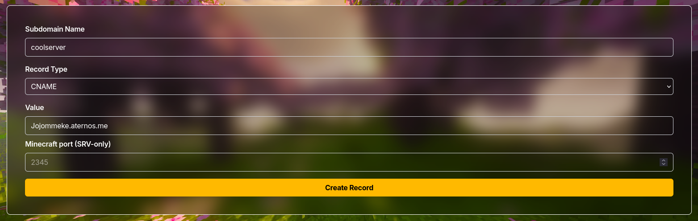

import { Wrench } from "lucide-react";

If you're using an Aternos server, you can also get a nice, fancy .jointhis.party custom IP.
In this guide we'll help you configure your custom "IP" for your Aternos-ran server.

As Aternos already uses their own SRV records and use dynamic IPs for their servers, this will be very easy.
So head over to our [subdomain tool](/tool) and fill in this information:

<Card
	icon={<Wrench />}
	href="/tool"
	title="Subdomain tool."
>
Go to our subdomain tool.
</Card>

## Configuration
**Subdomain name**:
Your server name will become -> [subdomain name].jointhis.party.

**Record Type**:
CNAME.

**Value**:
Old .Aternos.me server IP.

**Port**:
Leave empty.

An example would be:

You can now connect to your server on: `[subdomain name].jointhis.party.`!
