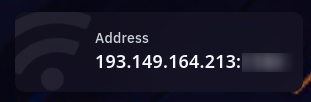
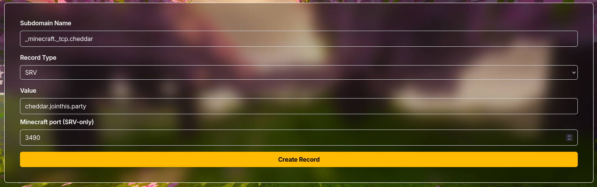

If you're currently hosting your minecraft server on Embotic, you can also get one of our free .jointhis.party subdomains!

As Embotic is a bit more DIY-friendly, we just get our IP + port from them on the panel!
This allows us to use an SRV record to link our subdomain to their servers.

## SRV record
*This section will explain what an SRV record is and how it works, if you just want to configure and not learn, skip this section.*
An SRV record is a way to tell your computer to connect to another port instead of the default expected. It can be configured for a list of fixed services including minecraft java edition, which uses 25565 as default port. When using minecraft java, you'll have to suffix your subdomain with `_minecraft._tcp.` This will tell the computer to connect to the domain via your specified port.
This is useful for reverse proxies or other services that use nonstandard ports, including Embotic.
<Callout title="expansion planned" type="info">This section will be expanded in the future.</Callout>

## Configuring the record
Start by figuring out your IP and port, head to [the panel](https://panel.embotic.xyz/), navigate to your server and view your IP and port.

*I've blurred the port to avoid people joining the server.*

### Configuring the A record.
Our SRV record needs an A record first, we'll start by configuring that.

**Subdomain name**:
Your server name will become -> [subdomain name].jointhis.party.

**Record type**:
A

**Value**:
The IP from embotic, excluding the port (include only everything before the colon.)

**Port**:
Leave this empty.

Example:

### Configuring the SRV record

Now for the SRV-record, we'll need to use our port. For my example, I'll use the port `3490` but this will be different for you, it's the part after the colon in the IP.

**Subdomain name**:
_minecraft._tcp.[Subdomain name from the A record]

**Record type**:
SRV

**Value**:
[Subdomain name from the A record].jointhis.party

**Port**:
Port from embotic.

Example:

You can now connect to your server on: `[subdomain name].jointhis.party.`!
