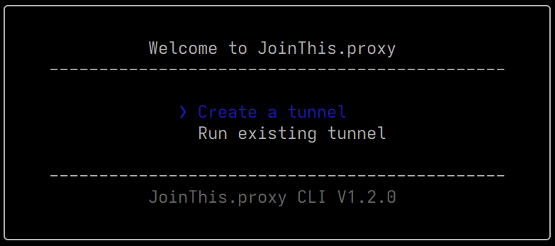
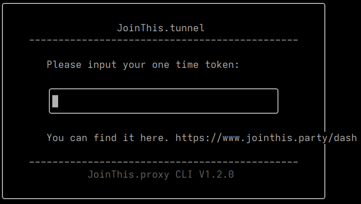
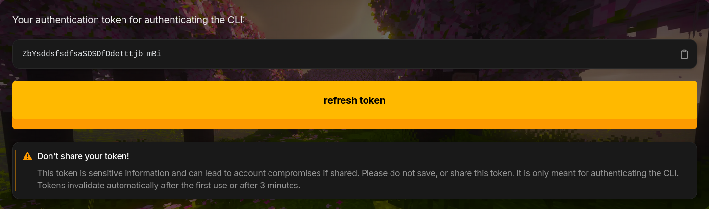
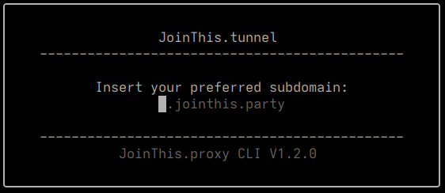
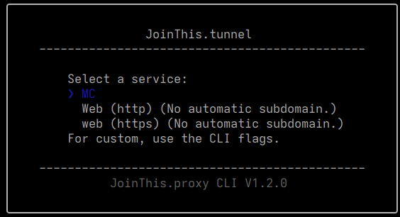

import { Step, Steps } from "fumadocs-ui/components/steps";

<Callout type="success" title="Recommended method.">
    This method is safer, as it doesn't require opening ports or messing with your firewall. I do recommend to close all ports on your firewall anyways though. It should also be the easiest for beginners to utilize. {/*<!-- rumdl-disable-line MD013 -->*/}
</Callout>

## Installation

<Steps>
<Step>

### Installing PNPM

Source: [https://pnpm.io/installation](https://pnpm.io/installation)

<Tabs items={['Linux', 'Windows']}>
<Tab value="Linux">
Use whatever you have installed:

cURL:

```bash
curl -fsSL https://get.pnpm.io/install.sh | sh -
```

wGET:

```bash
wget -qO- https://get.pnpm.io/install.sh | sh -
```

</Tab>
<Tab value="Windows">
Powershell:

```powershell
Invoke-WebRequest https://get.pnpm.io/install.ps1 -UseBasicParsing | Invoke-Expression
```

</Tab>
</Tabs>

<Step>

### Running JoinThis.proxy

<Tabs items={['run', 'install', 'update']}>
<Tab value="run">

To just run JoinThis.proxy without installing, use:

```bash
pnpm dlx jointhis.proxy@latest
```

</Tab>
<Tab value="install">

To install JoinThis.proxy, use:

```bash
pnpm i -g jointhis.proxy@latest
```

You can now run the program with:

```bash
jointhis-proxy
```

</Tab>
<Tab value="update">

```bash
pnpm update -L -g jointhis.proxy
```

</Tab>
</Tabs>

</Step>

</Step>
</Steps>

## Using the tool

### General usage

```bash
jointhis-proxy
```



Press enter to continue creating your tunnel.



Now you get prompted to input your token, you can find this on the [dashboard](/dash).
First, log in with discord, next press view token, you should now have this:



Now copy this token or transfer it to your server, and paste it into the CLI.
Next, you'll be asked for a subdomain:



This you can choose, as long as it is not taken, reserved or already used by you.



Now you can choose your service, which is either minecraft or web for now.
For web, your subdomain most likely won't work due to TLS conflicts.
If you need another kind of internal port, refer to the command line guide below.

Now wait until everything is set up. If you receive any errors,
don't hesitate to make a support ticket.

As a last step, your tunnel will run and you will get your external IP.
This will be your subdomain for java and proxy.jointhis.party with a random port
for bedrock.

### Command-line usage

For advanced users, you can use command-line flags.
To view the most current flags, execute:

```bash
jointhis-proxy --help
```

This will output the current usage instructions.
After running the first setup flags, please do run

```bash
jointhis-proxy --run
```

After the first setup, to avoid re-creation of the tunnel every time you run it.

### Running the tunnel after creation

If you've already went through the setup wizard or configured with CLI flags,
you can choose to run your already created tunnel by using:

```bash
jointhis-proxy --run
```

Or choosing "run existing tunnel" in the CLI.

## Disclaimer

By using the tool and making a tunnel, you agree to the [TOS](/docs/terms)
and the [Privacy Policy](/docs/policy/).

## Technical breakdown

The CLI is made in NodeJS and is fully open source.
[https://gitlab.com/jointhisparty/jointhis.proxy](https://gitlab.com/jointhisparty/jointhis.proxy)

It communicates with the web server and hands it the One Time Token,
and the DNS record to create. The web server then verifies your session, makes
the DNS records using the Cloudflare API, and gets a configuration file from the
proxy server and assigns it to the Discord user ID of the user. The authentication
token will get sent back to the CLI alongside the external ports. Now the CLI
will download the backend library/binary which is [https://github.com/snsinfu/reverse-tunnel](https://github.com/snsinfu/reverse-tunnel).
It will then write a configuration file in the current directory and launch the
binary with the config file to connect to the server.

The run function just runs the binary, without any creation or assigning of
authentication tokens.
