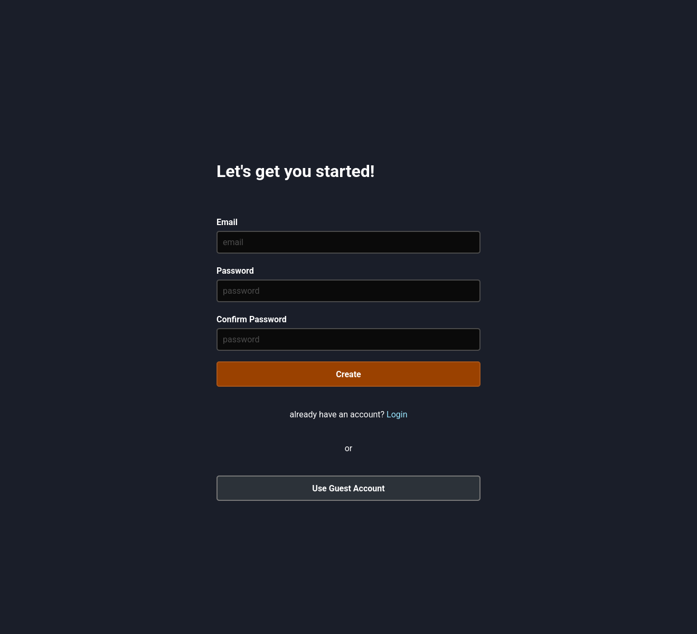
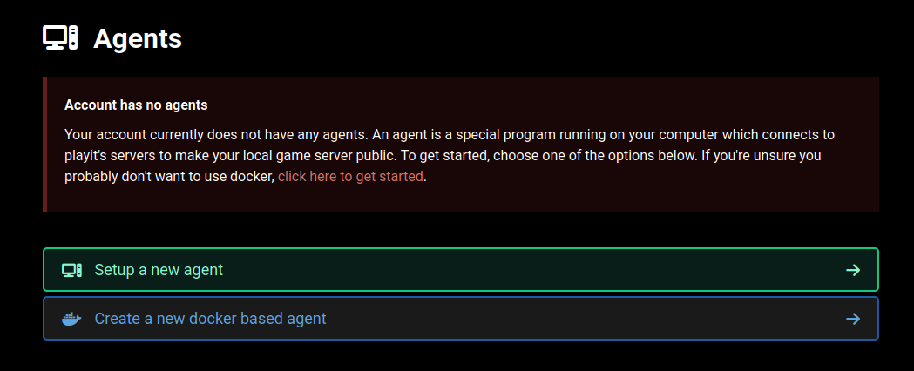
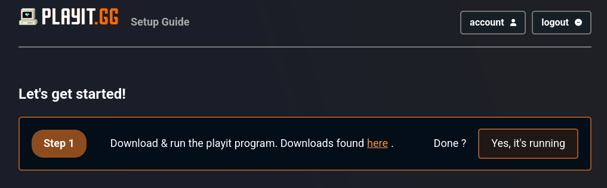
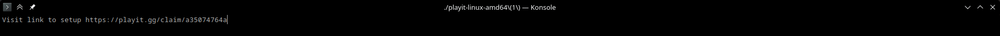
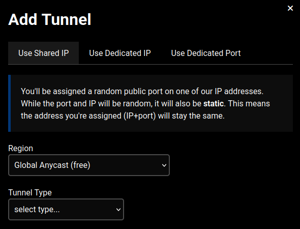

import { Step, Steps } from 'fumadocs-ui/components/steps';
import { House } from "lucide-react";
import { Globe } from "lucide-react";
import { Gamepad } from "lucide-react";
import { Wrench } from "lucide-react";
import { Speech } from "lucide-react";

<Callout type="success" title="Recommended method">
	Using a reverse-proxy is generally much safer than using port forwarding, therefore we recommend this.
</Callout>
<Callout type="warning" title="Recent changes in playit.">
	Playit has seen a lot of abuse, which has led them to limit their service for free users. You can now only make minecraft and terraria tunnels.
</Callout>

I'll start by explaining what this is to give you a bit of context. A reverse proxy is essentially external port forwarding, you install their program (which is open-source and safe in the case of playit) and this program will intercept your outgoing traffic and send it to their servers. Their servers will then proceed to forward that traffic and make it publicly accessible by port forwarding on their side. If there is incoming traffic, it will be accepted by their servers and sent to the program you installed. The program will then proceed to forward that traffic into your server. The obvious downside of this is latency and the reliability on a service for your networking. The free services mostly are heavily used and can be slower at peak-hours.
You can read more on this in [this article](https://www.cloudflare.com/learning/cdn/glossary/reverse-proxy/) cloudflare wrote.

# Services
There are a lot of reverse proxy services to consider, we recommend [playit.gg](https://playit.gg/) because it's free and we have experience with it. It is not the fastest nor the greatest but it does a great job and is very user-friendly. We'll be basing this tutorial on playit. If you want to use another service you can get support in [our discord server](/discord).

<Steps>
<Step>
# Getting started
In order to use playit, you'll need an account. Head over to https://playit.gg/ and sign up.

I don't recommend logging in as guest.
</Step>
<Step>
# Registering your agent
Once you have created your account, you will be met with this:

You'll have to press setup a new agent.

</Step>
<Step>
# Downloading the server program
So, you should download the software on their download page linked. I recommend using Linux for any servers but if you want to self host on your own machine windows is fine.
For debian-based servers, I highly recommend using their debian application:
```bash
curl -SsL https://playit-cloud.github.io/ppa/key.gpg | gpg --dearmor | sudo tee /etc/apt/trusted.gpg.d/playit.gpg >/dev/null
echo "deb [signed-by=/etc/apt/trusted.gpg.d/playit.gpg] https://playit-cloud.github.io/ppa/data ./" | sudo tee /etc/apt/sources.list.d/playit-cloud.list
sudo apt update
sudo apt install playit
```
Now in order to run it, just enter `playit` in your terminal.
When running the agent for the first time, you'll be met with this:

Open the url to link your agent to your account. Proceed to setup the agent by following the provided instructions.
Now you should be able to setup a tunnel:

You have successfully registered playit and can now continue to a guide to follow:
<Cards>
	<Card icon={<Gamepad />} href="/docs/minecraft" title="Minecraft">
		Get your java domain clean and smooth! We can even remap ports!
	</Card>
	<Card icon={<Globe />} href="/docs/web" title="Websites">
		Host websites with SSL, cloudflare proxying and the right ports!
	</Card>
	<Card icon={<Gamepad />} href="/docs/games" title="Games">
		Host your games with the right ports and of course, a free subdomain!
	</Card>
	<Card icon={<Wrench />} href="/docs/custom" title="Custom">
		Host your services with a free subdomain!
	</Card>
</Cards>
<br/>
</Step>
<Step>
# Extras
## Autostart
If you want the application to automatically start on your system, you should use their systemd service. This is only available for people who have downloaded the debian version as recommended previously. To activate it, simply use this command:
```bash
sudo systemctl start playit --now
```
This will activate the systemctl service, to avoid problems you can now close the window of playit you originally had open. Playit should continue itself in the background.

I do not yet have a method for this on windows, but for other linux distros you can make your own systemctl service or use crontab.
This section will be expanded in the future.
</Step>
</Steps>