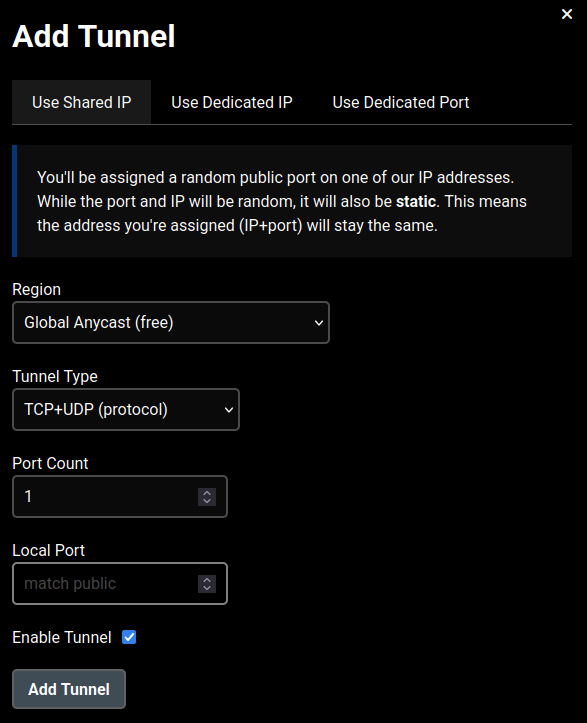
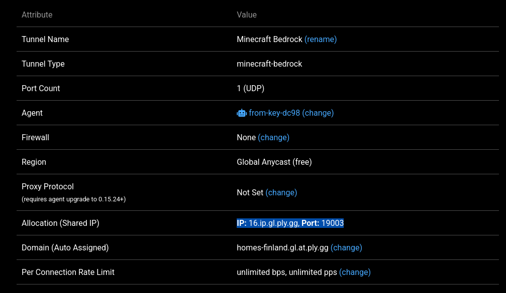
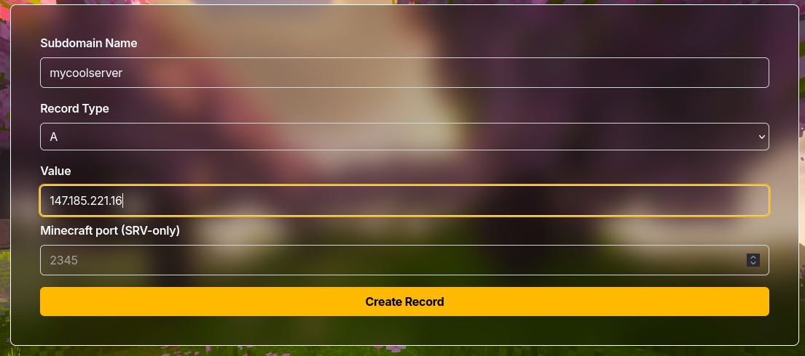

import { Step, Steps } from 'fumadocs-ui/components/steps';
import { Accordion, Accordions } from "fumadocs-ui/components/accordion";
import { EarthLock } from "lucide-react";
import { ArrowUpDown } from "lucide-react";

<Steps>
<Step>

# Choosing your network forwarding method
## How to decide:
### Port forwarding

<Accordions>
<Accordion title="Benefits">
- Faster network (lower ping)
- Easier configuration for ports
- Full control
</Accordion>
<Accordion title="Cons">

- Requires access to the router
- Can be impossible on certain ISPs (CGNAT)
- Can be exploited by malicious actors (see [Port forwarding](../(forwarding)/portforwarding.mdx))
</Accordion>
</Accordions>

### Reverse-proxy

<Accordions>
<Accordion title="Benefits">
- Very safe
- No need to access router
- Works on almost all networks
- Simple
</Accordion>
<Accordion title="Cons">
- Can be costly depending on the service (we recommend a free service)
- Can cause high ping to clients
- Can cause instable connections
- Can be a bit less reliable if the service goes down.
</Accordion>
</Accordions>

</Step>
<br/>
<Step>

# Forwarding to the network
<Tabs items={['Reverse proxy', 'Port forwarding']}>
	<Tab value="Reverse proxy">
		<Callout title="Safer method">
			Using a reverse-proxy is generally much safer.
		</Callout>
		<Card icon={<EarthLock />} href="/docs/reverseproxy" title="Setting up a reverse proxy">
			Click to open the dedicated guide.
		</Card>
		<br />
		# Setting up the playit tunnel.
		You should first figure out what ports or connections your service needs. You can find this out in their documentation. Most applications will use TCP. There are exceptions like minecraft bedrock and simplevoicechat. This will also be present in their documentation. Once again I do recommend just using TCP+UDP.

		

		You should set the local port to the port that your service uses.
		You will now be assigned a random IP and port.

		If you scroll down on your tunnel page, you should get this.
		

		We are looking for the allocation.
		In my case this is:
		
		IP:
		```
		16.ip.gl.ply.gg
		```
		PORT:
		```
		19003
		```

		However, the IP is not a real IP yet. It is currently a domain.

		You can find the real IP by using this command:
		```bash
		dig 16.ip.gl.ply.gg +short
		```
		Don't forget to replace 16.ip.gl.ply.gg with your "IP",
		
		The output will look something like this:
		```zsh

		[16:27:58] [~] ❱❱❱ dig 16.ip.gl.ply.gg +short

		147.185.221.16
		```
		With 147.185.221.16 being our IP.

		# Creating uour jointhis.party record.
		Now in order to use our custom domain, we'll need to create an A record.
		We only need our subdomain name, which will be the part before `.jointhis.party`
		And our IP to resolve to which in my case will be `147.185.221.16`

		So head to [our subdomain manager](/tool), and fill in your info:
		
		Mycoolserver will probably be taken, so you can make your own creative name for your service/server.

		You can now reach your server on: 
		```
		[yoursubdomain].jointhis.party:[playitPORT]
		```
	</Tab>
	<Tab value="Port forwarding">
		<Callout title="Advanced users only" type="warning">
			Port forwarding poses multiple security risks if you don't know what you're
			doing so we only recommend this if you do know what you're doing.
		</Callout>
		<Card icon={<ArrowUpDown />} href="/docs/portforwarding" title="Setting up port forwarding">
			Click to open the dedicated guide.
		</Card>
		Now that we have successfully port forwarded, we can skip to making our subdomain work!

		# Creating your jointhis.party record.
		So as with the proxy config, we'll only be needing to make an A record.
		With our Value being our public IP. You can find this by searching for "what is my ip" on DuckDuckGo, or using one of the results from google.

		And our subdomain name will be your creative server name.

		

		You can now reach your server on: 
		```
		[yoursubdomain].jointhis.party
		``` 
	</Tab>
</Tabs>

</Step>
</Steps>