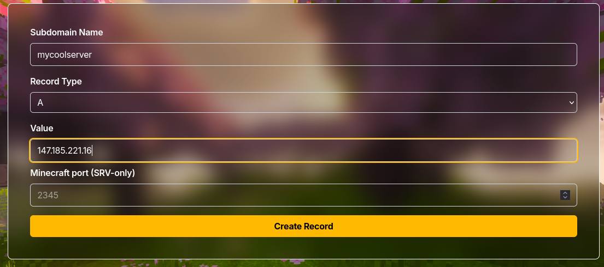

import { Step, Steps } from "fumadocs-ui/components/steps";
import { Accordion, Accordions } from "fumadocs-ui/components/accordion";
import { EarthLock } from "lucide-react";
import { ArrowUpDown } from "lucide-react";

<Steps>
<Step>

## Choosing your network forwarding method

### How to decide

#### Port forwarding

<Accordions>

<Accordion title="Benefits">

- Faster network (lower ping)
- Easier configuration for ports
- Full control

</Accordion>
<Accordion title="Cons">

- Requires access to the router
- Can be impossible on certain ISPs (CGNAT)
- Can be exploited by malicious actors
  (see [Port forwarding](<../(forwarding)/portforwarding.mdx>))

</Accordion>
</Accordions>

#### Reverse-proxy

<Accordions>
<Accordion title="Benefits">

- Very safe
- No need to access router
- Works on almost all networks
- Simple
- Integration with DNS creation (jointhis.proxy)

</Accordion>
<Accordion title="Cons">

- Can cause high ping to clients
- Can cause instable connections
- Can be a bit less reliable if the service goes down.

</Accordion>
</Accordions>

</Step>
<Step>

## Forwarding to the network

<Tabs items={['Reverse proxy', 'Port forwarding']}>
  <Tab value="Reverse proxy">
    <Callout title="Safer method">
      Using a reverse-proxy is generally much safer.
    </Callout>
    <Card icon={<EarthLock />} href="/docs/jointhisproxy#command-line-usage" title="Setting up JoinThis.proxy"> {/*<!-- rumdl-disable-line MD013 -->*/}
      Click to open the dedicated guide.
    </Card>
    </Tab>
      <Tab value="Port forwarding">
        <Callout title="Advanced users only" type="warning">
          Port forwarding poses multiple security risks if you don't know what
          you're doing so we only recommend this if you do know what
          you're doing.
        </Callout>
        <Card
          icon={<ArrowUpDown />}
          href="/docs/portforwarding"
          title="Setting up port forwarding"
        >
          Click to open the dedicated guide.
        </Card>
        Now that we have successfully port forwarded,
        we can skip to making our subdomain work!

    ## Creating your jointhis.party record.

    So as with the proxy config, we'll only be needing to make an A record.
    With our Value being our public IP.
    You can find this by searching for "what is my ip" on DuckDuckGo,
    or using one of the results from google.

    And our subdomain name will be your creative server name.

    

    You can now reach your server on:

    ```text
    [yoursubdomain].jointhis.party
    ```

    </Tab>

</Tabs>

</Step>
</Steps>
